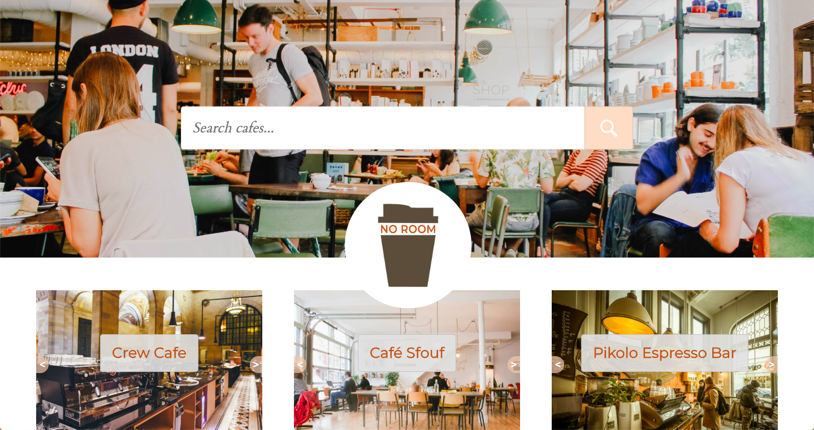

</img>

No Room is a responsive web app built with Javascript technologies for checking seating availability in Montreal cafes.

## Features
- Cafe owners can log in and create their cafe with an interactive drag and drop seating layout created without libraries. 
- The user views a searchable map with location markers.
- On the cafe page, the seating layout will update live for the user as the owner indicates seats are taken. 

[See No Room in action](http://unbouncepages.com/noroom/)
